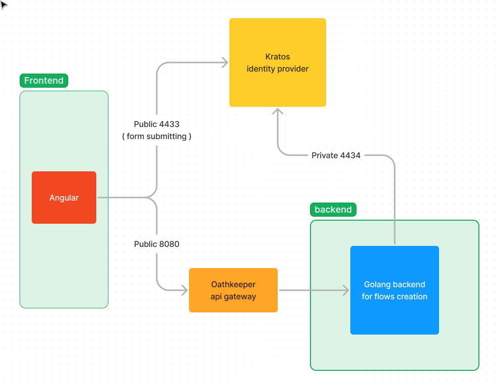

# Angular Kratos Ui

This is example of implementation [Kratos](https://github.com/ory/kratos) ui with
Angular framework. Here I was trying to replicate default [Kratos Node UI](https://github.com/ory/kratos-selfservice-ui-node)
forms.

## Start

```bash
make start

cd frontend
npm run start
```

### Architecture


### Notes

This is unusual how we can pass env parameters into `kratos.yml`. For more
information you can read this links:
- https://www.ory.sh/docs/ecosystem/configuring
- https://github.com/ory/kratos/issues/1535 ( I have used the way which is not 
worked in the issue, but it works for me. May be I used newer version)

Basicaly we need to get absolute "path" to your yaml variable like in json file,
but instead of dots - use underscore sign, and all should be uppercase. Like this:

```yaml
selfservice:
  methods:
    oidc:
      config:
        providers:
          - id: google
            client_id: "should be secret"
            client_secret: "should be secret"
```

Transforms into this 2 variables:

```
SELFSERVICE_METHODS_OIDC_CONFIG_PROVIDERS_0_CLIENT_ID=
SELFSERVICE_METHODS_OIDC_CONFIG_PROVIDERS_0_CLIENT_SECRET=
```

Zero in variable name is number of provider in `providers` array. So if you will have multiple
providers - it will be:

```
SELFSERVICE_METHODS_OIDC_CONFIG_PROVIDERS_0_CLIENT_ID=
SELFSERVICE_METHODS_OIDC_CONFIG_PROVIDERS_0_CLIENT_SECRET=
SELFSERVICE_METHODS_OIDC_CONFIG_PROVIDERS_1_CLIENT_ID=
SELFSERVICE_METHODS_OIDC_CONFIG_PROVIDERS_1_CLIENT_SECRET=
SELFSERVICE_METHODS_OIDC_CONFIG_PROVIDERS_2_CLIENT_ID=
SELFSERVICE_METHODS_OIDC_CONFIG_PROVIDERS_2_CLIENT_SECRET=
```

Not tested yet with multiple providers, but I asume it should work some thing 
like this.

### About social login

How it works localy.
In https://console.cloud.google.com/ I have this redirect url:

```
http://localhost:4433/self-service/methods/oidc/callback/google
```

Create [google.jsonnet](./config/kratos/google.jsonnet) file:
```
local claims = {
  email_verified: true,
} + std.extVar('claims');

{
  identity: {
    traits: {
      [if 'email' in claims && claims.email_verified then 'email' else null]: claims.email,
      name: {
        first: claims.given_name,
        last: claims.family_name,
      },
    },
  },
}
```

This config allow you to save user first and last name into identity while registration. 
Official documentation propose [this example](https://www.ory.sh/docs/kratos/social-signin/google#data-mapping) 
which obviously, will not works if you do not add them into
[identity.schema.json](./config/kratos/identity.schema.json). I decided to update 
example jsonnet file and add "name" propery like in `identity.schema.json`. The
`hd` claim is:

> For Google, you can use the hd claim which is the hosted Google Workplace 
> domain of the user. This claim is used only when the user has a Google Workspace account. To learn 
> more about the ID payload returned by Google, read the [related documentation](https://developers.google.com/identity/protocols/oauth2/openid-connect#an-id-tokens-payload).

So, this variable is also absent in my jsonnet.